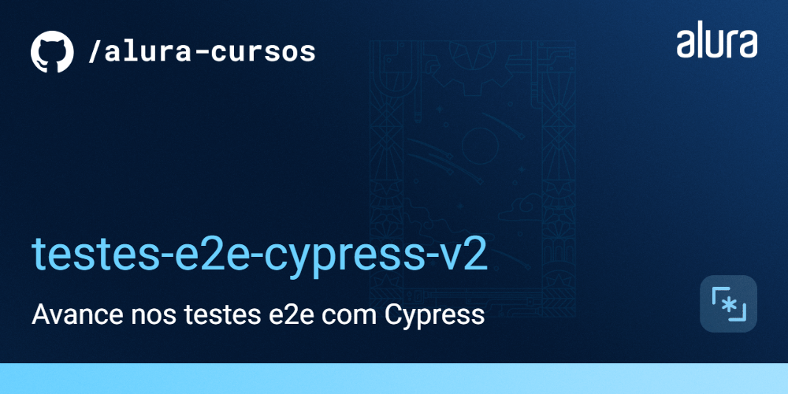
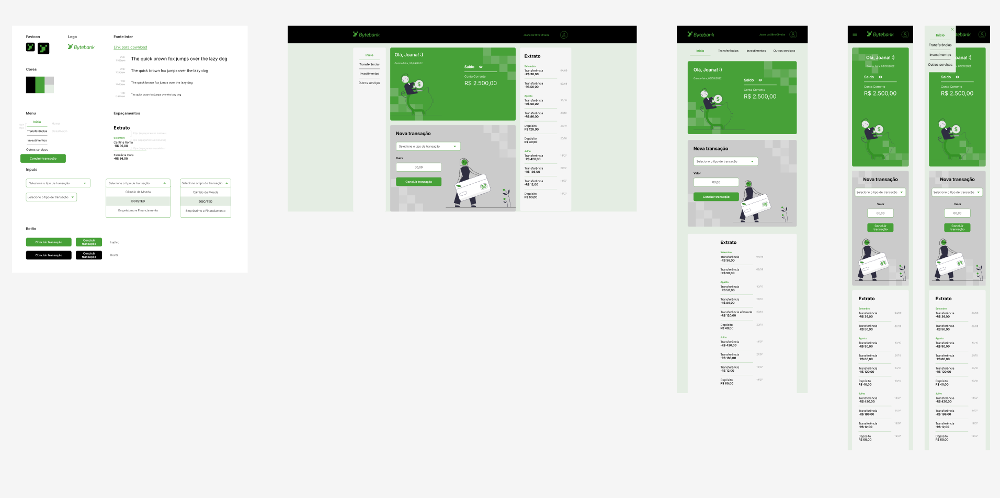

# 🏦 Bytebank v2.0 - E2E Testing with Cypress

O **Bytebank v2.0** é uma plataforma de banco digital fictícia desenvolvida para fins educacionais na Alura. Esta segunda versão do projeto foca na implementação de **Testes de Ponta a Ponta (E2E)** avançados, cobrindo novas rotas e fluxos de dados dinâmicos.



---

## 🚀 Funcionalidades Principais

A aplicação simula um ecossistema bancário completo, permitindo testar fluxos críticos como:
- **Minha Página**: Área exclusiva do usuário para visualização e edição de perfil.
- **Cadastro e Login**: Autenticação de usuários com fluxos de erro e sucesso.
- **Área do Cliente**: Consulta de saldo e extrato.
- **Transações**: Realização de transferências e depósitos.
- **Configurações**: Atualização de dados cadastrais.
- **Responsividade**: Testes em dispositivos móveis (viewport Mobile).

---

## 🛠️ Tecnologias & Ferramentas

- **Frontend**: [React.js](https://reactjs.org/)
- **API/Database**: [JSON Server](https://github.com/typicode/json-server)
- **Testes E2E**: [Cypress v12+](https://www.cypress.io/)
- **Gerador de Dados**: [@faker-js/faker](https://fakerjs.dev/) para massa de dados dinâmica.
- **Design de Referência**: [Figma do Projeto](https://www.figma.com/file/YJydxY5H8gf5lPLyKWOBbY).

---

## 🏁 Como Rodar o Projeto

Siga os passos abaixo para preparar o ambiente local:

### 1. Instalação
No terminal, execute:
```bash
npm install
```

### 2. Rodar a API (Servidor de Dados)
A API precisa estar ativa para os testes funcionarem. Rode:
```bash
npm run api
```
*O servidor rodará em `http://localhost:8080`.*

### 3. Rodar o Frontend (Aplicação)
Em um novo terminal, execute:
```bash
npm start
```
*Acesse a aplicação em `http://localhost:3000`.*

---

## 🧪 Rodando os Testes com Cypress

Com a aplicação e a API rodando, você pode abrir o painel de testes do Cypress:

```bash
npx cypress open
```

### Principais Scripts de Teste:
- `cadastro.cy.js`: Fluxo de criação de conta com dados via Faker.
- `dispositivoMovel.cy.js`: Testes de interface em viewport Mobile.
- `paginas.cy.js`: Navegação entre diferentes telas da aplicação.
- `configuracoes-usuarios.cy.js`: Atualização de perfil e persistência de dados.

### Sincronização de Fixtures (Custom Task):
Implementamos uma **Cypress Task** chamada `gerarUsuariosFixture`. Ela sincroniza automaticamente os usuários cadastrados no `db.json` com a fixture `usuarios.json`, garantindo que os testes sempre tenham dados válidos para login.

---

## 📚 Mais Informações
Projeto desenvolvido durante o curso de **Cypress: Testes E2E** na Alura. A ideia principal é mostrar como resolver problemas reais de sincronismo de dados e garantir a confiabilidade de uma aplicação financeira moderna.
